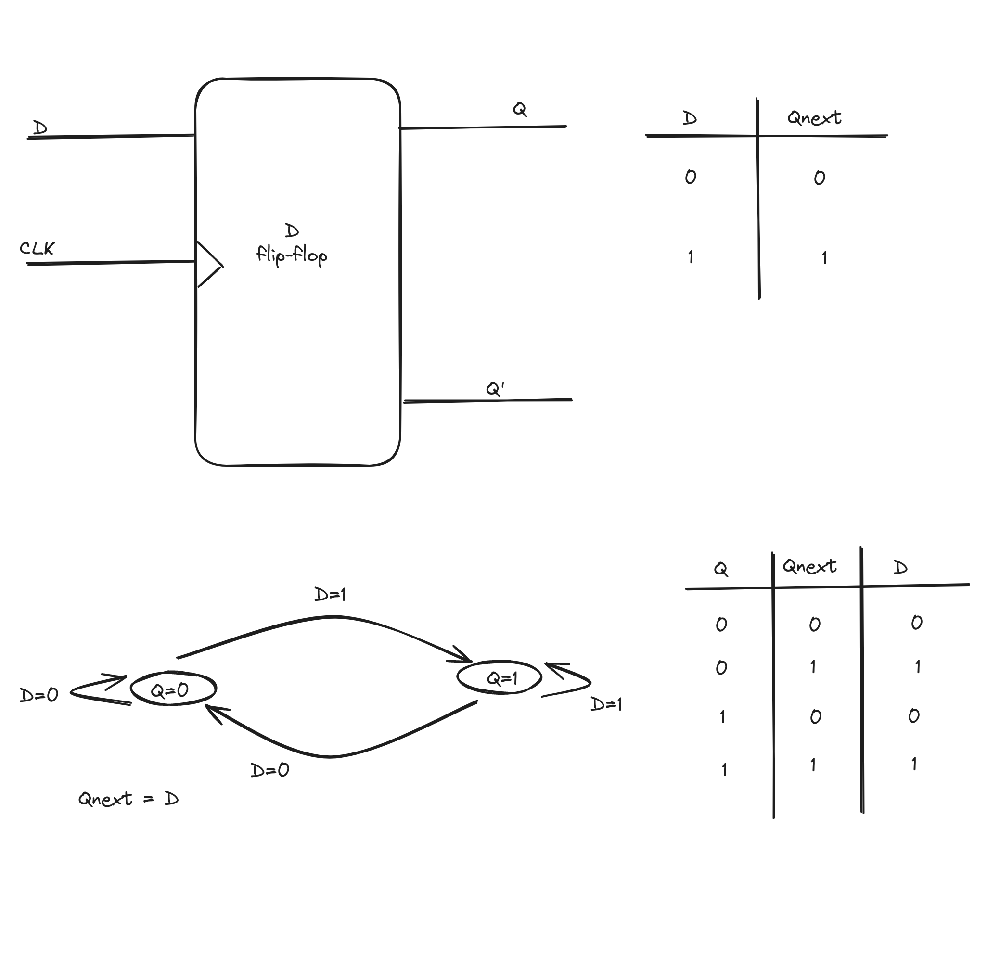
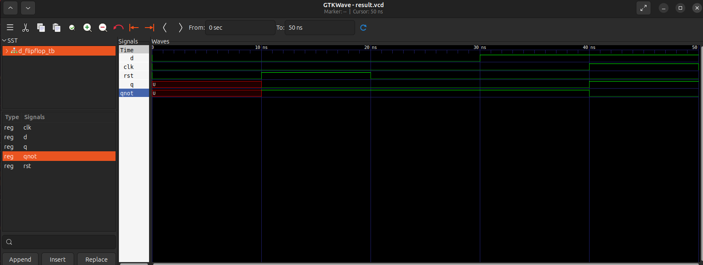

## file

- `d_flipflop.vhdl`: vhdl code for d flip-flop
- `d_flipflop_tb.vhdl`: vhdl code for testbench

## entity

- `D` : data input
- `CLK` : Clock input
- `RST` : Reset input (active-high, to reset the flip flop)
- `Q` : Output
- `Qnot` : Complmentary output of `Q`

# D Flipflop diagram

# Simulation result

